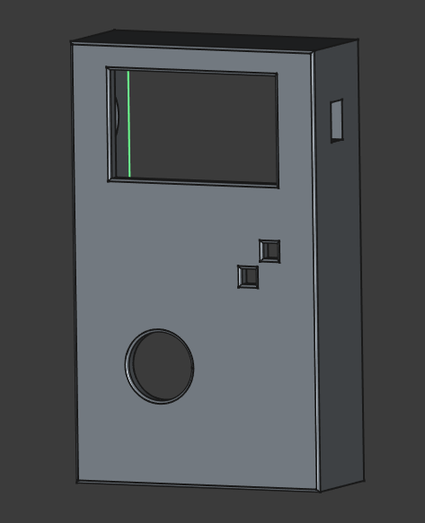
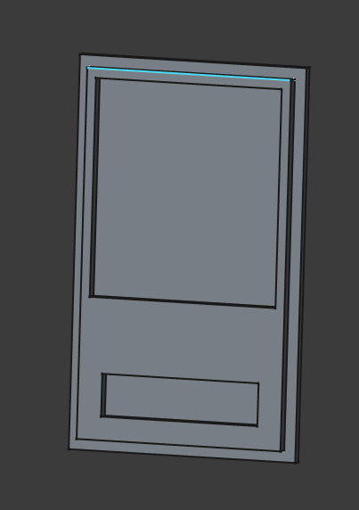

# Concept & Design prototype

## concept
im going to try to make the design look a little like an old gameboy. for designing i used the tool Freecad. 

## first design

frontpanel design:

in the design for the frontpanel i created several holes. one for the screen, one for the joystick, two push buttons, and an on off button. 

backpanel design:

on the backpannel you can see two indents, these indents are for 2 breadboards with an esp32 on it and for a li-ion 18650 battery. 

the front and backpanel are suposed to slot together without any glue or screws.

## current design
after 5 iterations of the frontpanel and 2 iterations of the backpanel, all the 3d prints are done and they fit.
the changes that were made are:
- screw pillars
- smaller joystick hole
- bigger on off hole
- direction of screen has changed
- size of screen has changed
- bigger buzzer hole
- bigger battery placement hole

this is the frontpanel:

this is the backpanel: 
